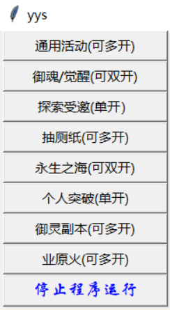
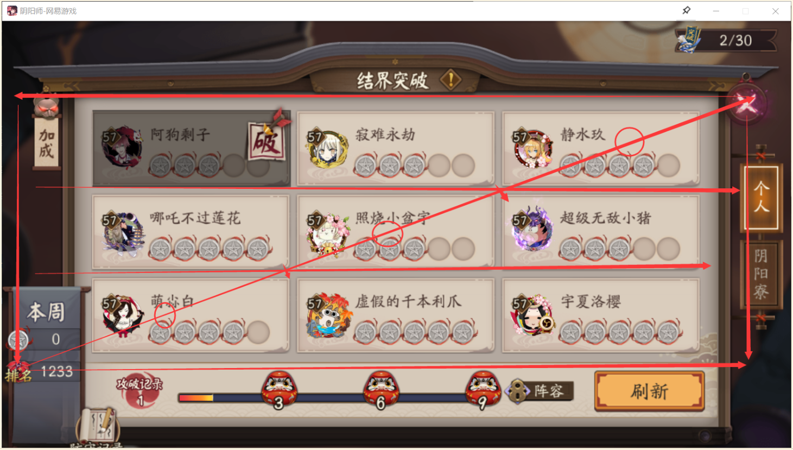

CSDN的文章编辑了一下后就发不出去了，所以传到这里，内容都懒得改了，大家觉得有用的点个star吧~
#### 0、前言：
- 本项目参考了[https://blog.csdn.net/m0_37316917/article/details/101605135](https://blog.csdn.net/m0_37316917/article/details/101605135)所用的图像对比的方法，项目原理就是截屏识别游戏内图标，根据不同界面设计的程序逻辑进行点击操作，不会修改和读取数据。
- 本项目任何桌面版阴阳师都可以用，电脑上开的安卓模拟器也可以用（模拟器内存消耗更大，不建议，如果要多开建议使用nga泥潭的痒痒熊多开工具[https://bbs.nga.cn/read.php?tid=17002730](https://bbs.nga.cn/read.php?tid=17002730)），此外，如果游戏更新图标有变需要截图替换掉对应目录下的图标才能正常运行（通用副本使用前请截图游戏内活动的挑战图标替换原本的图标，文件名要一样才行，图片大小参考其他功能的图片大小，替换无误如果还有问题建议尝试改变窗口大小后重试）
- 本项目仅用于学习交流，不得用于出售外挂等行为
- 请合理学习和测试，点击位置和停留时间做了随机处理，截图识别时间也是波动的，一般不会出问题，本人测试多日未出现封号，多个号挂机几个月也没有出现任何问题，但如果造成其他后果请自负责任（比如连续使用过久或者一段时间内耗费过多体力会因为行为检测被鬼使黑抓到）
- 运行环境：Python3.7+Pycharm（Pycharm社区版即可，可以不用pro版，Python必须为3.7，其他版本可能会有问题），**打开Pycharm时请以管理员方式打开**，然后运行 Window.py即可打开界面（如果想脱离Python环境使用可以在cmd中pip安装pip install pyinstaller，然后切换到src目录下，在地址栏输入cmd后输入命令pyinstaller -F Window.py进行打包，时间估计较久，多等一会在dist文件夹下就可以找到打包好的exe，如果要正常运行需要将项目中的img文件夹放到exe文件所在目录下，详情可以参考： [https://www.cnblogs.com/mini-monkey/p/11195309.html](https://www.cnblogs.com/mini-monkey/p/11195309.html)   ）
- 由于阴阳师里有些东西不好翻译，统一用的拼音（其他能用英文命名的变量就用的英文命名），如果要自行修改请参考具体写法甄别
- 如果导入工程出问题，或者不知道如何设置解释器等建议使用pycharm新建工程导入所需文件再试
#### 1、基本界面效果

设置的按F4 停止，但这效果不太行。。。好像只能在创建出的tk窗口中进行按键操作才会生效
我不知道有没有其他方法可以改进，先留着，最好在运行时设置一下等待时间或采用另外的方式停止程序。。。 其实识别有操作空档期，可以趁空档期关掉程序，问题也不是很大
#### 2、环境准备
需要pip安装的库：
+ pillow
+ pyautogui
+ numpy
+ opencv-python
+ opencv-contrib-python
+ 使用国内镜像源下载更快，使用方法可以像这样：
pip install -i https://mirrors.aliyun.com/pypi/simple/ opencv-python
+ 其他库如果有遗漏的根据报错自行搜索库名导入

提示：
参考的项目使用的SIFT探测器是老版本写法SIFT = cv2.xfeatures2d.SIFT_create()
新版本OpenCV库这个已经是专利算法，所以改用：SIFT = cv2.SIFT_create()

IDE使用的pycharm，搜索pycharm社区版下载默认安装即可

#### 3、御魂、觉醒、御灵、业原火、永生之海、通用活动实现思路

```python
//通用活动需要根据活动的具体挑战图标截图替换掉原有的图标
```

这类副本整体的思路是：
+ ①截取整个屏幕
+ ②处理页面图像，依次与各个设定的目标做匹配
+ ③根据匹配情况确定位置，如果没有匹配成功则位置信息为None
+ ④根据具体情况和优先级进行一定范围内的随机点击（可以自定义sleep时间）
+ ⑤不停重复截图扫描判定点击（可以在进入挑战后sleep一段时间以减少计算量）
#### 4、突破实现思路（目前有些问题不建议使用，本人已退坑不再修改）

突破选择57级的结界，8退4再突破最后一个既可以保证突破难度降低还可以保证收益高，同时结界等级不变，推荐突破阵容：面（散件）兔（火灵）缘（蚌精）麓（破势）蟹（心眼）。如果要实现3退1刷新等其他功能请自行编程实现

突破副本我的主要思路是：
+ ①根据左下角排名图标和右上角关闭图标确定一个矩形
+ ②然后可以根据矩形计算每个结界的位置（如上图）
+ ③依次点击判定是否突破完成
+ ④如果不是第九个进入等待突破即可
+ ⑤如果是第九个则连续退出四次再进入突破（退出按钮有时候识别出问题，这里我直接根据突破主界面计算出了退出的位置）
+ ⑥如果失败超过4次，那么表明有个结界一直无法突破，这时候刷新结界

**注：突破副本我实现后不太满意，有时候会bug所以不建议使用，如果想用最好自己编程实现一下**

#### 5、可能存在的一些问题
总的来说就是存在某些情况出现无法识别的和点击的问题
+ ①别人发来的协作有时候会由于界面大小不合适等原因无法识别和点击那个小叉，这导致卡在某一个界面，这个问题我尝试各种尺寸的图片进行识别，但还是效果不太好。。如果怕在这里卡界面可以自行将识别点击拒绝改为接受协作
+ ②使用的pyautogui库进行鼠标点击在最开始运行正常（**再提醒一下，一定要用管理员模式运行程序，不然没法进行鼠标的点击**），但是一段时间后可能无法点击，这个我目前没有找到原因所以也没法解决，但是大部分情况下还是运行正常的，如果出现这种情况，手动点击阴阳师某个地方或者停止后重新运行就可以继续正常运行。
+ ③掉线很久连上来、顶号等情况没有做处理，会卡界面如果需要的话可以自己编程实现这些特殊情况
+ ④特殊说明一下，如果是掉线后重连很久才连上来，且底层界面恰巧停留在结算界面，而运行的模块正在执行相关操作可能会一直点击（因为要点击的地方在底层，所以点击无效），如果这时候恢复网络了，阴阳师后台记录的相关数据可能会传到服务器，服务器**可能**会由于客户端的长时间高频点击认定开挂被鬼使黑抓到（这个具体我也不敢保证）
+ ⑤识别用的图片分辨率可能会影响效果，如果程序不起作用请根据实际分辨率界面图标替换
+ ⑥识别用的图片可能会随版本更替或者会因为使用的游戏皮肤变化，如果图片失效请根据实际图片替换
+ 综上所述，最好的办法是保持一个良好的网络环境再开始运行还有就是过一段时间就瞟一眼运行情况好做应对。
#### 6、写在最后

当初写这个一方面是因为自己是痒痒鼠重度玩家想自己实现个工具减轻肝度，另一方面是想接触使用OpenCV，但是感觉OpenCV有些东西做出来效果不太好，识别容易出问题，如果有更好的库最好尝试用一下其他的库去做识别。

本人从17年1月初到现在，断断续续退坑回坑起码四五次了，每天做日常打副本感觉像是游戏在玩我而不是我在享受游戏，真的有点累了，这也是我写这些代码的原因吧。由于点击做了随机位置模拟点击处理，时间也跟处理识别的时间波动而波动，一般来说是不会被检测的，我用了很久也没事，但是还是请大家不要用这个运行太久时间，或者一天之类耗费太多体力，这样很可能会被行为检测。

最后的最后，再强调一下，本文仅作为OpenCV相关的学习交流，请勿利用本项目做危害游 戏平衡和违法的活动。